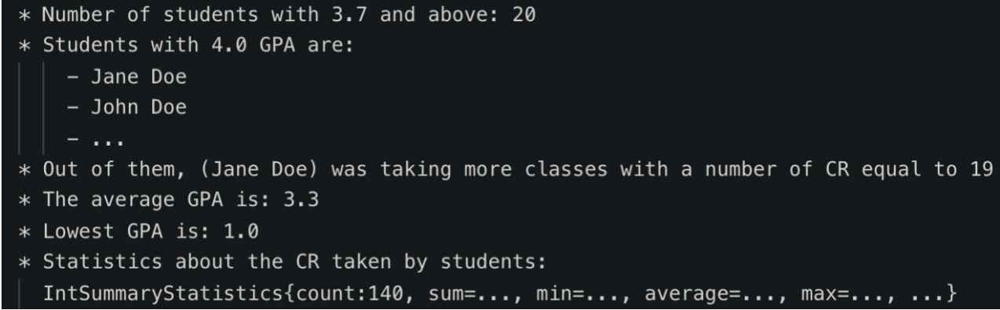

# Assignment 7 - Students Stream
{: .no_toc }

## Table of contents
{: .no_toc .text-delta }

1. TOC
{:toc}

---

## Lab Goals:
1. Practice using Java Streams.
2. Practice using Java Lambda Expressions

## Instructions
Create a Java project that reads the text file (*.csv) and uses Java Streams and Lambda
Expressions to answer the following questions.
    1. Count the students with 3.7 GPA and higher.
    2. List the students with 4.0 GPA.
    3. Out of the 4.0 Students who’s taking more classes?
    4. What’s the Average GPA for this set of data?
    5. What’s the lowest GPA?
    6. Use the IntSummaryStatistics Class to show statistics on the number of Credit Hours (CR) students are taking.

## Deliverables:
* A complete Java Project named StudentStreams.
* The used students file.
* The output should like something like:

## Grading
1. The program runs with no errors.
2. Proper usage of the lambda Expressions.
3. Proper usage of the Java Strmas
4. Logic is sound.
5. Proper usage of Git and GitHub (frequent commits, explanatory commit messages)

### Remember:
- Include the .gitignore file at the root of the git repository
o Make sure it’s named .gitignore not just gitignore
- Include README file at the root of the git repository Don’t forget to include README
file at the root of the git repository.
Submission:
You will be submitting a git repository, hosted on github.uc.edu, with the following naming
convention, <your 6+2>-assignment7-students-stream, (i.e., gilanyym-assignment7-students-stream)