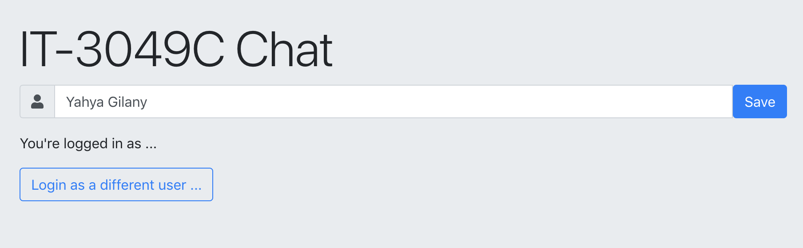

# Web Storage (Lab)

This lab we will be building on the Chat application we built before.

#### In this lab we will:
- Use localStorage to store the chatter's name.
- Use LocalForage to Store a background image.
- Use ServiceWorker and the upup to provide an offline page support

-----

### Part 0: Getting Started

Now in case you don't have the code from last lab readily available,
here's what we had up until this point

```
Folder Structure
.
+-- index.html
+-- main.css
+-- main.js
```

#### Starter files:
- [index.html](start/index.html)
- [main.css](start/main.css)
- [main.js](start/main.js)

.
- comment out this line to stop the requests to the server every 2 seconds

```js
setInterval(updateMessages, 2000);
```

----

### Part 1: Using `localStorage`
>**Result:**Ask the user to provide their name only once. The name will be saved in the browser and the input field will be hidden. Users will still have the ability to *"Sign in as a Different User"*.

- Modify the form group, adding a *save* button to save the username. Append the following after the `myName` input field
##### HTML

```html
<span class="input-group-btn">
    <button class="btn btn-primary" onclick="saveUserName()">Save</button>
</span>
```

The input field should now look like this


- create the `saveUserName()` function referenced by the button.
    - This function will store the value of the nameInput field using `localStorage`
##### JS

```js
function saveUserName() {
    localStorage.setItem(`UserName`, nameInput.value);
}
```

- create a `div` that will be displayed once the name is saved.
    - give this `div` an id of `afterLogin`.
    - give the `div` before it an id of `beforeLogin`

the jumbotron content should look close to this
##### HTML

```html
<h1 class="display-4">IT-3049C Chat</h1>

<div id="beforeLogin" class="input-group mb-3">
    ...
</div>

<div id="afterLogin" class="mb-3">
    <p id="currentUserParagraph">You're logged in as ...</p>
    <button class="btn btn-outline-primary" onclick="clearUserName()">Login as a different user ...</button>
</div>
```

The jumbotron/header should now look like this



- Now we need to create a function that we call when we click on the *"Login as a different user ..."* button
##### JS

```js
function clearUserName() {
    localStorage.removeItem(`UserName`)
}
```

- Add the `hidden` class to that new div so we can show it only when a name is saved.
##### HTML

```html
<div id="afterLogin" class="mb-3 hidden">
    ...
</div>
```

now it should look like this again ... (make sure your css code has the hidden class styles defined)


- Add references to the HTML elements of interest.
    - For better organization, it's advisable to place all references at the top of the JS code
##### JS

```js
const beforeLoginDiv = document.getElementById("beforeLogin");
const afterLoginDiv = document.getElementById("afterLogin");
const currentUserParagraph = document.getElementById("currentUserParagraph");
```

- create a function that updates the jumbotron/header contents
    - This function will get the UserName value stored in localStorage
    - if there's a value, it will hide the `beforeLogin` Div and reveal the `afterLogin` div.
    - it will also modify the paragraph element to show what user you're logged in as.
##### JS

```js
function updateHeader() {
    const username = localStorage.getItem(`UserName`);
    if(username) {
        beforeLoginDiv.classList.add(`hidden`);
        afterLoginDiv.classList.remove(`hidden`);
        currentUserParagraph.innerHTML = `You're logged in as ${username}`
    } else {
        beforeLoginDiv.classList.remove(`hidden`);
        afterLoginDiv.classList.add(`hidden`);
    }
}
```

This function will need to be called in 3 spots
- in the `saveUserName()`
- in the `clearUserName()`
- and on somewhere outside both function so it gets called on page reload.

    Now the functions should lool like this
##### JS

```js
function saveUserName() {
    localStorage.setItem(`UserName`, nameInput.value);
    updateHeader();
}

function clearUserName() {
    localStorage.removeItem(`UserName`);
    updateHeader();
}

updateHeader();
```

- Refresh the page, close the tab and open it again and the name should still be saved :)

> This is all for (Part 1) - Please Take a moment here and make sure you understand that section before you move on to the next part.

----
### Part 2: Using `localforage`
>**Result:** Users will be able to upload an image and use it a background image to the chat box. The application will store their image in the browsers's `indexedDB` using `localForage`

- Create a file input field in the header/jumbotron to collect the image file from the user.
    - Place the following code inside the `jumbotron` div and after the `afterLogin` div
    - give the file input an id of `imgFile`
    - the `accept` parameter defines what files are acceptable.
##### HTML

```html
<div class="form-group">
    <label for="imgFile">Background Image</label>
    <input type="file" class="form-control-file" id="imgFile" accept="image/*">
</div>
```

- Create a reference to the file input in the JS code.
##### JS

```js
const fileInput = document.getElementById("imgFile");
```


- Create an `EventListener` to listen to file input changes (we could also add a submit button and listen to the click event, but this is acceptable for now)
    - The eventListener below, creates an object URL to the file that can be used a `src` URL.
    - it modifies the background of the chatbox to use the uploaded image.
##### JS

```js
fileInput.addEventListener('change', function(e) {
    const file = fileInput.files[0];
    const imageType = /image.*/;

    if (file.type.match(imageType)) {
        const objectUrl = URL.createObjectURL(file);

        chatBox.style = `background: url(${objectUrl})`

    } else {
        console.log(`not supported`)
    }
});
```

- Load the application, confirm that the application can read an image file display it as a background image for the chat box.
    - Notice that if you refresh the page, the image will go away. now we need to save the image to the browser's indexedDB using `localforage`.


- Include the `localforage` library by adding it before the `main.js` file in the html file imports
##### HTML

```html
    <script src="https://cdnjs.cloudflare.com/ajax/libs/localforage/1.7.2/localforage.min.js"></script>
```

- modify the the file change `eventListner` to save the file using `localforage`.
##### JS

```js
fileInput.addEventListener('change', function(e) {
    const file = fileInput.files[0];
    const imageType = /image.*/;

    if (file.type.match(imageType)) {
        localforage.setItem(`photo`, file)
        .then(() => {
            const objectUrl = URL.createObjectURL(file);

            chatBox.style = `background: url(${objectUrl})`
        })
    } else {
        console.log(`not supported`)
    }
});
```

- let's create a function that is called at the loading of the page to update the background image
    - the function will get the image stored using `localforage`.
    - convert it to a `blob` object.
    - generate an object URL that can be used as a `src` URL.
##### JS

```js
function updateBackgroundImage() {
    localforage.getItem(`photo`)
        .then(image => {
            const blob = new Blob([image]);
            const imageURL = URL.createObjectURL(blob);
            chatBox.style = `background: url(${imageURL})`;
        });
}
```

- Call the `updateBackgroundImage()` function setting the photo as well as on page reload.

    now the fileInput change `eventListener` should be look like
##### JS

```js
fileInput.addEventListener('change', function(e) {
    const file = fileInput.files[0];
    const imageType = /image.*/;

    if (file.type.match(imageType)) {
        localforage.setItem(`photo`, file)
        .then(() => {
            updateBackgroundImage()
        })
    } else {
        console.log(`not supported`)
    }
});
```

> This is all for (Part 2) - Please Take a moment here and make sure you understand that section before you move on to the next part.
---

### Part 3: Using `ServiceWorker`
>**Result:** Provide offline page support to our application by building a default page that is displayed when the network goes offline.

- Create an offline page
##### HTML

```html
<!DOCTYPE html>
<html>

<head>
  <title>You are not connected to the Internet</title>
  <meta name="viewport" content="width=device-width,initial-scale=1">
  <style>
    body {
      background-color: rgb(160, 27, 27);
      color: #2E2F30;
      text-align: center;
      font-family: arial, sans-serif;
      margin: 0;
    }

    div.dialog {
      width: 95%;
      max-width: 33em;
      margin: 4em auto 0;
    }

    div.dialog>img {
      display: block;
      margin-left: auto;
      margin-right: auto;
      width: 100%;
    }

    div.dialog>div {
      border: 1px solid #CCC;
      border-right-color: #999;
      border-left-color: #999;
      border-bottom-color: #BBB;
      border-top: #B00100 solid 4px;
      border-top-left-radius: 9px;
      border-top-right-radius: 9px;
      background-color: white;
      padding: 7px 12% 0;
      box-shadow: 0 3px 8px rgba(50, 50, 50, 0.17);
    }

    h1 {
      font-size: 100%;
      color: #730E15;
      line-height: 1.5em;
    }

    div.dialog>p {
      margin: 0 0 1em;
      padding: 1em;
      background-color: #F7F7F7;
      border: 1px solid #CCC;
      border-right-color: #999;
      border-left-color: #999;
      border-bottom-color: #999;
      border-bottom-left-radius: 4px;
      border-bottom-right-radius: 4px;
      border-top-color: #DADADA;
      color: #666;
      box-shadow: 0 3px 8px rgba(50, 50, 50, 0.17);
    }
  </style>
</head>

<body>

  <div class="dialog">
    
    <div>
      <h1>It looks like you've lost your Internet connection</h1>
      <p>You may need to reconnect to Wi-Fi.</p>
    </div>
  </div>
</body>

</html>
```

- Load the page in the browser.
- create the following two files
    - [upup.min.js](js/upup.min.js)
    - [upup.sw.min.js](js/upup.sw.min.js)

```
Folder Structure
.
+-- index.html
+-- main.css
+-- main.js
+-- upup.min.js
+-- upup.sw.min.js
```

- include the following snippet from the `upup` library to your html code.
##### HTML

```html
<script src="upup.min.js"></script>
<script src="upup.sw.min.js"></script>
<script>
    UpUp.start({
      'content-url': 'offline.html' // show this page to offline users
    });
</script>
```

- Now the only way we can validate that this actually worked, is to setup a webserver to serve the html file. (Not gonna ask you to that!)

    A good workaround for that is to use a Google Chrome Extension
[Web Server for Chrome](https://chrome.google.com/webstore/detail/web-server-for-chrome/ofhbbkphhbklhfoeikjpcbhemlocgigb?hl=en)

- Launch this extension and select your folder as the root for the webserver.
- open the Server's URL in the browser

- Open up the developer tools, go the application tab, and change the application service worker status to offline and then reload the application.

---

## For 1 point of Extra Credit 🎉
in the code we built this lab, there's a piece of redundant code. Identify and show me that you found it.

---
## For 5 points of Extra Credit 🎉
implement an additional feature that will listen for absense of online connection.

once detected, it will need to pause the requests going out to the server until the connection is gained back, it will also need to store the chat history locally and then sends it to the server, once the connection is regained.

