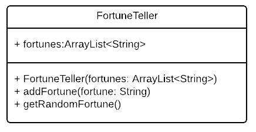
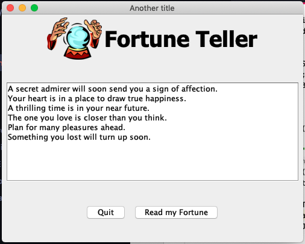

# Fortune Teller

## Lab Goals:
1. Practice using Swing to create Graphical User Interfaces.
2. Learn to use the online Java documentation to figure out how to do things that I have not shown you directly.

## Instructions:
1. In the FortuneTellerGUI project, create a fortuneTeller class based on the following UML Diagram. 
    * prepopulate the `FortuneTeller` ArrayList with at least 12 humorous fortunes.
    * Make sure that you implement the `getRandomeFortune` method in a way that wouldn't return the same fortune as the last one presented.
        * To be clear, the program will repeat fortunes just not the same one twice in a row.
        * (Hint: remember the index of the current fortune and when you generate a new random index, make sure that it is different from the previous one.)

2. Modify the `FortuneTellerFrame.java` class so it inherits from `JFrame`.

3. Create the components and configure the Layout to achieve the following:
    * The application frame is 500 points wide, and 400 tall.
    * The application Frame will contain 3 panels (top, middle, bottom - Which means there's a fourth that contains them all)
        * **Top Panel**: Contains a `JLabel` with text “Fortune Teller” and an `ImageIcon` (an image is already included in the assets folder).
        The JLabel has a constructor that takes a String and the ImageIcon.

            * A link to the docs is [here](https://docs.oracle.com/javase/7/docs/api/javax/swing/JLabel.html#JLabel(java.lang.String,%20javax.swing.Icon,%20int))
            * Change the Label fontFace to .... and set the size to 36.

        * **Middle Panel**: A `JTextArea` within a `JScrollPane` where the fortunes will be displayed one per line. Again, set the font values so that it works. (Should be smaller than the large text of the Top panel.)

        * **Bottom Panel**This panel will have 2 buttones: A button with the label “Read My Fortune!”. And another with the label “Quit

4. When the user clicks on the “Read My Fortune” button, the application should call the `getRandomFortune` method of the `FortuneTeller` class.
    * Note that the textArea will display all the fortunes that the user receives one after another and then will be scrollable.

5. Use the Java 8 Lambda Expressions for the actionListner of the quit button.

### Outcome
