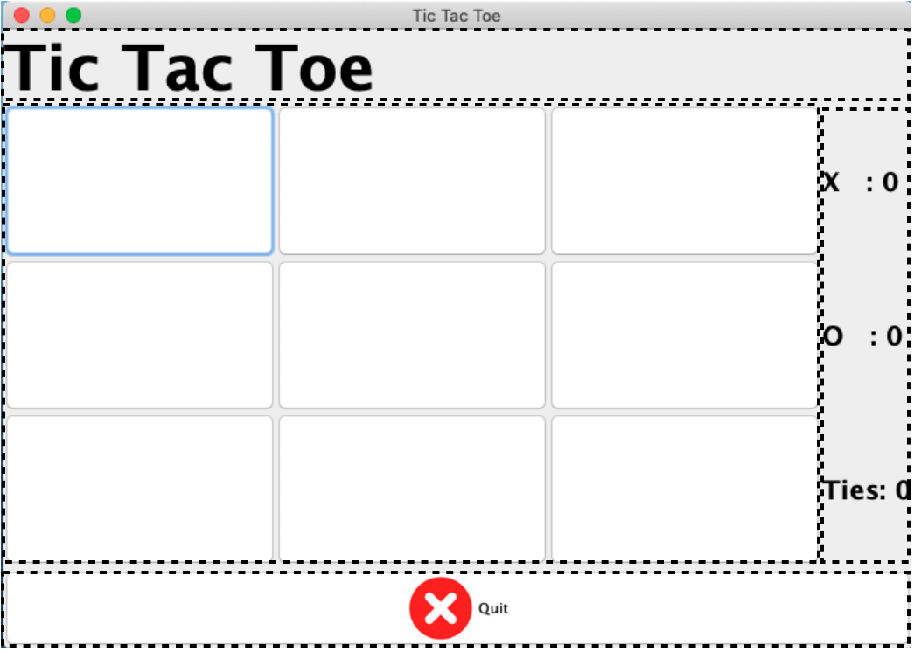

# Lab 5 - Tic Tac Toe GUI
{: .no_toc }

## Table of contents
{: .no_toc .text-delta }

1. TOC
{:toc}

---

## Lab Goals:
1. Get practice with using the Java GUI methods.
2. Adding a GUI to an exisitng console application program.

## Discussion:
It is not uncommon to develop the logic of a program as a console application (NO GUI) and then craft a GUI on to it later. There are also many reasons for separating the GUI of the program from the rest of the code logic. (This is part of a common design pattern called Model-View-Controller (MVC) where the GUI represents the View aspect.) For instance, you might have a Web-based or mobile device GUI in addition to a Desktop Application one…

So for this lab, we will recode a 2-player Tic Tac Toe game. You can use the same internal data representation (board) and much of the code from the previous version.

The starter files includes a copy of the Tic Tac Toe console program code.

The game facilitates two human players enforcing the rules for the game and determining ties and wins. It prompts the user to play again when a game ends. Again all of that in a Console application.

## Final Result:
You will be submitting a git repository with the following naming
convention, `5-tic-tac-toe-gui-<your-github-username>`, (i.e., `5-tic-tac-toe-gui--Ygilany`). The repository contains:
1. one Java Project with the following files:
    - TicTacToeFrame.java (JFrame extended class)
    - TicTacToeRunner.java (has a main method)
2. a modified README.md file that includes your self-assessment

----

## Instructions
1. Look an the implementation of the Console Tic Tac Toe Game.
    * `TicTacToe.java`
    * `TicTacToeTile.java`
    * `TicTacToeConsoleRunner.java`

2. Create `TicTacToeFrame.java` that inherites from `JFrame`.

3. Create `TicTacToeGUIRunner.java` which should have a main method that initializes the Frame class.

4. in the `TicTacToeFrame.java` class start by creating the constructor that"
    * sets the Frame title. (use the inherited/super constructor for this)
    * sets the Frame size to (700 * 500).
    * sets the Default Close Operation to terminate the application on close.
    * makes the frame visible.

5. Create the necessary components to produce the following: (the dashed lines represent `JPanel`s)
    
    * mainPanel
        * mainLabel
        * gameBoardPanel
            * All the game tiles/buttons
        * buttonPanel
            * quit Button
                * the button also shows an `imageIcon`
        * resultsPanel
            * XWinsLabel
            * OWinsLabel
            * TiesLabel

6. Create the Layout Manager objects to produce
    * Border Layout
        * mainPanel
        * btnPanel
    * GridLayout
        * gameBoardPanel
        * resultsPanel

7. Create the necessary Font Objects as such
    ```java
      Font gameBoardFont = new Font("Helvatica", Font.BOLD, 20);
      Font XOButtons =  new Font("Helvatica", Font.BOLD, 30);
      Font mainLabelFont = new Font("Helvatica", Font.BOLD, 48);
    ```

8. Modify the `TicTacToeTile.java` class such that it extends the `JButton` class. This will allow us to use the same class for both Console and GUI applications.

9. Modify the `SetValue()` method of the `TicTacToeTile` so it sets the text to the value passed

    ```java
      public void setValue(String value) {
          this.value = value;
          setText(value);
      }
    ```

10. In the `TicTacToeFrame` class, Instantiate the following objects to track the game state and game results across multiple attempts.
  ```java
    TicTacToe game = new TicTacToe();
    TicTacToeTile[][] board = game.getBoard();

    int Owins = 0;
    int Xwins = 0;
    int ties = 0;
  ```


11. create a `UISetup()` method that would be called from the constructor. The method should
    * set the layout of each panel
    * sets the fonts of each label
    * adds the labels to `resultsPanel`
    * adds the buttons to the `buttonsPanel`
    * creates the implementation of the `quitButton` using the LamdaExpression format.
    * Sets the gameBoard such that each button/tile in the board is
        * added to the `gameboardPanel`
        * configured to use the `XOButtons` Font.
        * has an actionListener (Leave the button implementation empty for now)
    * adds the components and sub-panels to the `mainPanel`
        * Since the mainPanel uses the `BorderLayout`, you will need to assign a location to the components as you add them to the `mainPanel`:
            * mainLabel : NORTH
            * gameBoardPanel : CENTER
            * resultsPanel : EAST
            * buttonPanel :  SOUTH

12. Create the implementation of the Tile Buttons. (check out what the console game used to do on user play)
    * Figure out which button was clicked. (hint: use the actionEvent.getSource())
    * Play Turn
        * if the current Turn was "X" Set the ForgroundColor to Blue, otherwise Red.
    * Call the `CalculateResult` method.
    * if the game is over:
        * update the gameresults board.
        * prompt the user if they want to play again
        * if they do want to play again, reset the game


    <details>
      <summary markdown='span'>Here's how
      </summary>

    ```java
      board[row][col].addActionListener((ActionEvent ae) -> {
          TicTacToeTile selected = (TicTacToeTile) ae.getSource();
          game.playTurn(selected.getRow(), selected.getColumn());
          selected.setForeground(
                  game.getCurrentTurn().name().equals("X") ? Color.BLUE: Color.RED
          );

          game.calculateResult();

          if(game.isOver()) {
              System.out.println("The game is over and the Result is: " + game.getResult());
              updateGameResults();
              Boolean done = SafeInput.getYNConfirmDialog("Play Again?");
              if(!done) {
                  System.exit(0);
              }
              resetGame();
          }
      });
    ```

    </details>


13. Figure out a way so a button can only be used once.

## Grading
1. The program runs with no errors.
2. Created a GUI application.
3. Logic is sound.
4. Proper usage of Git and GitHub (frequent commits, explanatory commit messages)