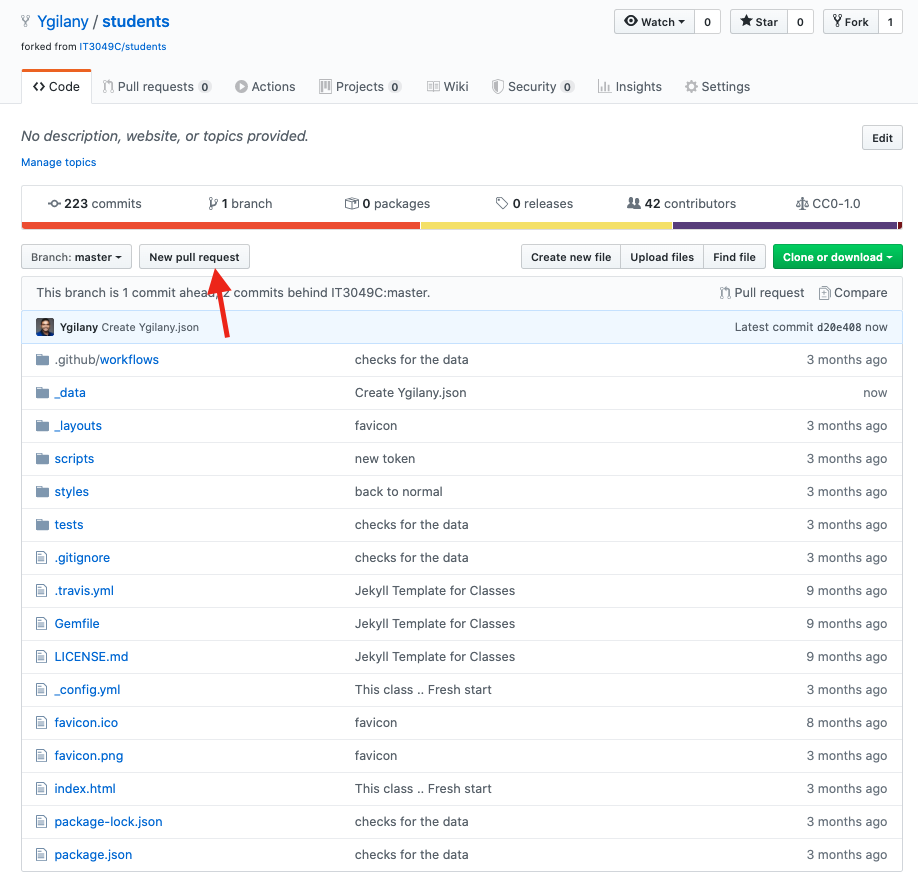

# 1. Online Portfolio (Lab)
{: .no_toc }

## Table of contents
{: .no_toc .text-delta }

1. TOC
{:toc}

---
This is a **2-parts** lab; 
1. **Part 1:** Creating a Web Page and hosting it. ~(17 pts)~
    
    practice creating HTML page, with CSS and checking-in your work to a GitHub Repository where you're the only collaborator.
2. **Part 2:** Creating a Pull Request ~(3 pts)~
    
    you'll practice creating a branch on a repository with multiple collaborators and submitting a pull request.

Accept the GitHub Classroom assignment on Canvas to create a repository for you with some starter files.

#### Guidelines
* Don't just use a online template. If you do, make sure it still satisfies the requirement below to pass the automated grading.
* This assignment is in a lab-style. Follow the instructions step-by-step.
* To run the automated grading checks, make sure you have installed Node.js.


## Lab Goals
1. Practice the **usage of Git and GitHub** in submitting the assignments.
    * Make Frequent git commits. 
        * As a rule of thumb, you should commit your code at the end of every complete thought.
        * Planning your code will help you identify checkpoints where you can commit your code.
        * Use meaningful commit messages.
    * This assignments will suggest a few checkpoints where it might be appropriate to commit the code. This won't be in all assignments.
2. Review creating simple web pages using *HTML*.
3. Review styling web pages using *CSS* to make the page look aestatically pleasing.
4. Deploy your site and hosting in on *GitHub Pages*.
5. I need to learn about you :)
6. Introduce yourself to the class as you'll need to team up for the final project.

<hr>

## Instructions

### Part 1: Create a Web Page

#### Setup
1. Accept the assignment on canvas.
  This will create a repository for you with a few starting files. The following directories are the only ones you're allowed to modify
    ```
    .
    ├── resources
    │   ├── images
    │   │   └── .gitkeep
    │   ├── scripts
    │   │   └── index.js
    │   └── styles
    │       └── styles.css
    ├── index.html
    └── README.md
    ```

2. Clone down the project to your computer.
    * [Using GitHub Desktop](https://help.github.com/en/desktop/contributing-to-projects/cloning-a-repository-from-github-to-github-desktop)
    * OR [using command line tools](https://help.github.com/en/github/creating-cloning-and-archiving-repositories/cloning-a-repository)

3. Open the project in Visual Studio Code.
  a. make sure you select the root folder when opening the project. It will be named something like `1-online-portfolio-YOUR_USERNAME`


#### Creating the Webpage
1. Where it says `<!-- include style files here-->`, add a `<link>` with a reference to the styles sheet located in `resources/styles/styles.css`.

2. Where it says `<!-- include script files here-->`, add a `<script>` with a reference to the scripts file located in `resources/scripts/index.js`.

3. inside the container `<div>`. make an `<h1>` that contains your name.

4. Modify the HTML `<title>` to match the title in `h1` tag.

5. add an image `` of yourself.
    * make sure the image is placed in `resources/images` and that you use relative path not the complete file path. I can't access files on your computer (DUHH!).
        * Do 
        ```
            
        ```

        * Don't do
        ```
            
        ```

6.  `git commit -m "initialized the page"`. 

7. For Each of the following 5 sections:
    * make sure to wrap the section with a `<div>` with a class name of `section` and is assigned the respective id specified below
    * each section must be titled with `<h2>` tags
    * sections are:
        * Personal background - with an id of `personalBackground`
            *  `git commit -m "added Personal background section"`.
        * Work and Development Experience - with an id of `experinence`
            *  `git commit -m "added Work and Development Experience section"`.
        * Programming Languages - with an id of `programmingLanguages`
            *  `git commit -m "added Programming Languages section"`.
        * Achievements - with an id of `achievements`
            *  `git commit -m "added Achievements section"`.
        * Favourite Games (or ones you’re currently playing) - with an id of `games`
            *  `git commit -m "added Favourite Games section"`.

8. Pretty-ify the page with some custom styles in `resources/styles/styles.css`
    * [Bootstrap library](https://getbootstrap.com/) is already included at the top of the HTML file. You're welcome to use it.
    * make a git commit once done with the styling or incrementally as you're making your changes.

9. Once you are finished, make sure you push all the changes to the repository.

### Output
any thing looking like this or better is accepted.


#### Run Autograder checks
1. Open your preferred command line terminal (i.e. terminal, iTerm, bash, git bash, powershell, ... etc) and navigate to the project path. 
    * remember [the `cd` command](http://www.linfo.org/cd.html) from System Admin class.
    * Using Visual Studio Code you can simply open the integrated terminal (View > Terminal) which will automatically open up at the correct project path.
        * [More info on vscode integrated terminal can be found here](https://code.visualstudio.com/docs/editor/integrated-terminal)

2. install project depenedencies using the following command: `npm install`

3. run the following command: `npm test`. a suite of tests will run producing results similar to the following.

#### Setting up GitHub Pages for hosting
1. Follow the following [instructions](https://help.github.com/en/enterprise/2.13/user/articles/configuring-a-publishing-source-for-github-pages#enabling-github-pages-to-publish-your-site-from-master-or-gh-pages) to setup github pages and **publish your page from `master`**.

<hr>

### Part 2: Create Pull Request
In this part, we will practice making changes directly on GitHub using the in-browser editors. (You're welcome to clone down the repository and make your changes locally)

1. On [this Repository (https://github.com/IT3049C/students)](https://github.com/IT3049C/students), Fork the repository using button on the top right.
    * 
    * This will create a repository on your account, with the content of this repository.
2. On the forked repo, navigate to the `_data/CURRENT_SEMESTER` folder: where `CURRENT_SEMESTER` is just a placeholder for what the semester would be, create a new file named `YOUR_GITHUB_USERNAME.json`. 
    * *NOTICE:* github username isn't necessarily your 6+2.
    * For example, my 6+2 is `gilanyym` but my GitHub username is `Ygilany` and so my file name would be `Ygilany.json`
    * 
4. Copy the snippet below, and make changes as instructed.
    ```
      {
          "emoji": ":smirk_cat:",
          "role": "Student",
          "introduction": "I'm excited to learn about you all!",
          "achievements": [
              "achievement1",
              "achievement2"
          ],
          "links": {
              "site": "LINK_TO_YOUR_WEBSITE",
              "linkedin": "LINK_TO_YOUR_LINKEDIN_PROFILE",
              "facebook": "LINK_TO_YOUR_FACEBOOK_PROFILE",
              "twitter": "LINK_TO_YOUR_TWITTER_PROFILE",
          }
      }
    ```
5. Introduce yourself by modifying the file.
    * use this [Emoji cheat sheet](https://www.webfx.com/tools/emoji-cheat-sheet/) to select an `emoji`.
    * type in a short message in the introduction line
    * The `achievements` is an array of strings.
        * list 2-4 achievements or highlights you’ve accomplished recently that you’d like to share with the class.
        * Don't forget the trailing commas.
    * The links should at least constain the `site` key with the link set to your hosted github page.
        a. you may share your linkedin profiles here as well.
        c. You can remove the lines for the social media options you're not sharing.
    * The file MUST follow with the following Schema.

6. commit the changes
    * 
7. Submit a Pull Request from this fork back to the original repository.
    * 
    * Confirm the head repository is your fork and create a PR.
        * 
8. Copy the URL to the pull request and submit that on Canvas.

### Grading
1. The WebPage has all the required sections.
2. The Web Page is aesthetically pleasing.
3. The Web page is hosted on GitHub Pages.
4. Pull request is submitted