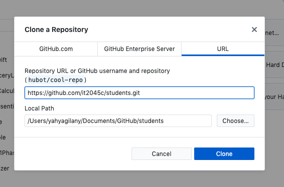

# Submitting your assignment (Lab)
- Go to your GitHub profile, Edit your profile, to add your name and upload an image of yourself.
- Go to the [students: IT3049C students over the years](https://github.com/IT3049C/students) Repository in the Class organization.
- Copy the Git URL to the repository


- Clone down the repository to your local computer.
	- **Method 1: Using GitHub Desktop**
		- We want to clone an existing repository. So you can either:
			1.  select the first option on the left `Clone a Repository from the Internet…`
			2. OR, you can go to the menu bar and select `File` -> `Clone Repository...`  
		- Go to the URL tab and in the first text field, paste in the git URL to the repository.
			* 
		* The Second field is where the project will be downloaded to. Once you’re done, click clone.
	* **Method 2: Using the Command line**
		1. using the command line, navigate to where you want to clone the project. Using the `cd` command. i.e.: `cd path/to/where/you/want/to/save/the/project`
		2. Clone the project: `git clone https://github.com/it2045c/students.git`
			* you may be prompted to login with your username and password
* Create a branch off of master.
	- **Method 1: Using GitHub Desktop**
		- Create a `New Branch`
		* 
		* to ensure uniqueness, name the branch with your 6+2
		* 
	* **Method 2: Using the Command line**
		* run the following command `git checkout -b gilanyym`
			* instead of `gilanyym` type in your 6+2.
* Create a file under `_data/Spring22` . The file should be named as `GITHUB_USERNAME.json` for example: `Ygilany.json`
* Introduce yourself by modifying the file using any Text Editor of your choice
	* use this [ Emoji cheat sheet ](https://www.webfx.com/tools/emoji-cheat-sheet/) to select an emoji. (First line of the example file below)
	* type in an introduction message in the introduction line
	* list 2-4 achievements you’ve accomplished recently that you’d like to share with the class.
	* Share at least your LinkedIn profile page in the links section.
```json
{
		"emoji": ":smirk_cat:",
		"role": "Student",
		"introduction": "I'm excited to learn about you all!",
		"achievements": [
			"achievement1",
			"achievement2"
		],
		"links": {
			"site": "LINK_TO_YOUR_WEBSITE",
			"linkedin": "LINK_TO_YOUR_LINKEDIN_PROFILE",
			"facebook": "LINK_TO_YOUR_FACEBOOK_PROFILE",
			"twitter": "LINK_TO_YOUR_TWITTER_PROFILE",
		}
}
```

* on GitHub Desktop, you should something like this

* You can then click the `commit` button then the `publish branch`
* Go back to the file and make one change to the file
* Make another commit and push
* Create a pull Request to project
	- **Method 1: Using GitHub Desktop**
		- You can click the `Create Pull Request` button


Or through the website


* make sure you select your branch from this list


* modify the pull request title, then select `create pull request`


Let me know once you’re done


### Resources
- [Setting up GitHub Desktop](../extras/setting_up_github_desktop.md)
