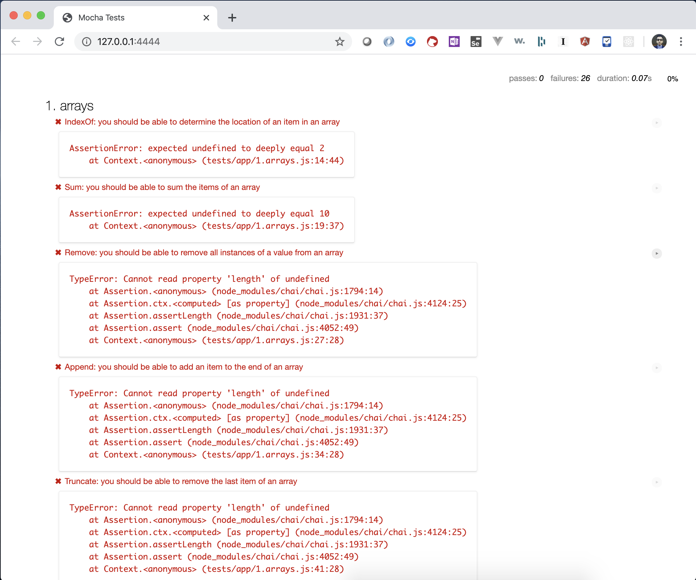
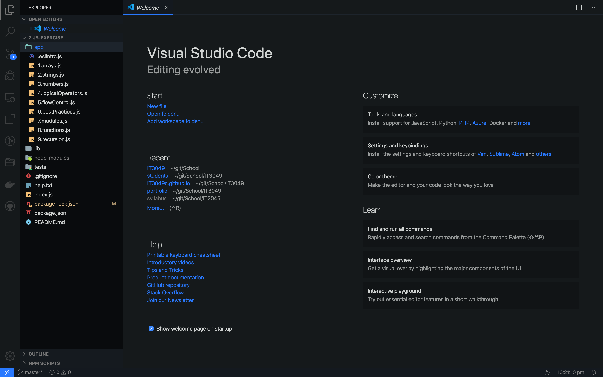

# 2. JavaScript Exercise
{: .no_toc }

## Table of contents
{: .no_toc .text-delta }

1. TOC
{:toc}

---

## Lab Goals
This Lab is collection of JavaScript execises and coding challenges. It's focused on problem solving techniques and JavaScript Fundamentals.

## Tips and Guidelines
* Make a git commit at the **end of each** of the exercises.

## Instructions
1. Accept the Assignment on Canvas.
  This will create a repository for you with a few starting files. The following directories are the only ones you're allowed to modify
  ```
    .
    ├── app
    │   ├── .eslintrc.js
    │   ├── 1.arrays.js
    │   ├── 2.strings.js
    │   ├── 3.numbers.js
    │   ├── 4.logicalOperators.js
    │   ├── 5.flowControl.js
    │   ├── 6.bestPractices.js
    │   ├── 7.modules.js
    │   ├── 8.functions.js
    │   └── 9.recursion.js
    ├── lib
    │   └── ...
    ├── tests
    │   ├── app
    │   │   ├── .eslintrc.js
    │   │   └── ...
    │   └── runner.html
    ├── .gitignore
    ├── help.txt
    ├── index.js
    ├── package-lock.json
    ├── package.json
    └── README.md
  ```

2. Clone down the repository to your local computer.
3. Install the project dependencies using the `npm install` command.
4. Run the project using `npm start`
5. The project should run in the browser at the following URL `localhost:4444` OR `127.0.0.100:4444` in your browser.
  - You may remember from your networking class that your computer localaddress is `127.0.0.1`
6. For this assignment, you will modifying the files in the app folder. Each file repesent a suite of function that you'll implement untill all the tests pass.
7. Don't forget to fill out the self assessment in the `README.md` file.
8. commit and push your code.

### Demo:
#### Setup
1. Navigate to your repository in the command line using the `cd PATH_TO_FOLDER` command.
  - in my case the command was `cd /Users/yahyagilany/git/School/IT3049/2.JS-Exercise`
  - use the `pwd` command to `P`rint `W`orking `D`irectory.
2. Installing the dependencies `npm install`
3. starting the project `npm start` and opening `127.0.0.100:4444` in the browser.
  
  - notice all the errors, our goal for this assignment is to resolve them all.
  - on the top, you see the tally of how many tests passed, and how many are failing.
  - next to each test, there's a little play button to run that a specific test.


#### Getting Down to Business
1. Open the project in *Visual Studio Code* (Not Visual Studio)
  
2. Open the file `app/1.array.js`
  - notice all the functions have empty implementations, our tasks is provide implementation so the tests pass.
3. After consulting the JS documeantion provided at the top of the file (OR [this one](https://developer.mozilla.org/en-US/docs/Web/JavaScript/Reference/Global_Objects/Array)), you should be able to identify the functions needed to be used.
4. for the first test, the `indexOf` method is supposed to return the index of a certain element in an array. [You can learn more about JS Built-in method here](https://developer.mozilla.org/en-US/docs/Web/JavaScript/Reference/Global_Objects/Array/indexOf)
5. my implementation for this is as follows
  ```js
    function indexOf(arr, item) {
        return arr.indexOf(item);
    }
  ```

6. Look back on the tests page on the browser. Notice the test pass.
  
7. Commit the changes with a proper commit messgae.
8. On to the next test .. Rinse and Repeat🧪


