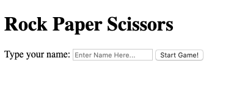
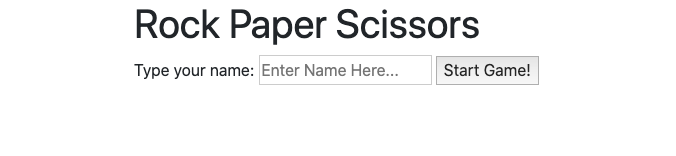

# 3. Rock Paper Scissors
{: .no_toc }

## Table of contents
{: .no_toc .text-delta }

1. TOC
{:toc}

---

## Lab Goals
1. Build our first game using HTML, CSS, and JavaScript.
2. Demonstrate ability to use Bootstrap to setup the page layout.
3. Demonstrate ability to create forms with the form/input elements.
4. Demonstrate understanding of event-oriented programming.

## Overview
This assignment, we will be building the Rock, Paper, Scissors(RPS) game. We will be utilizing the concepts and techniques covered in the past few weeks to allow a user to play against the Computer. The game flow should be:
1. Web page loads with a form to input user’s name (input is required, they cannot submit it without a value).
    * **concepts**: Building forms, Event-handeling, user input validation.
2. User submits name and a new form appears with an input for Rock, Paper, or Scissors.
    * You can use:
      * select/dropdown
      * OR buttons
      * text buttons (but why would you do that!)
3. User submits the form with their selection (input is required, they cannot submit it without a selection)
4. Computer Generates a response.
5. Determine the winner.
6. Display the winner.
7. Keep history of selections and winner of each round and display it.
8. Reset the form after each round
9. User should be able to start a new game.

### Guidelines
* commit your code frequently.
* Use useful commit messages.
* Make sure tests pass.
* at the end of each of the following steps, run the tests to make sure you finished the step correctly.
* **Don't forget to fill out the self assessment on the README file**.

## Instructions
### Setting up the Layout
1. Change the HTML `<title>` tag to `Rock Paper Scissors`.
2. Inside the `
` element, create a `<h1>` with the title of `Rock Paper Scissors`.
    
    **The game will have 2 screens/2 `
`s: (1)Welcome Screen. (2)Game Screen.**

3. Create a `
` with an ID of `welcome-screen`.
    * *Tip:* try typing `#welcome-screen` and hit enter 😉
4. Create a `
` with an ID of `game-screen`.
    * make sure the `game-screen` **IS NOT** nested inside the `welcome-screen`.
    * *Tip:* try typing `#welcome-screen` and hit enter. It's old now!
5. inside the `welcome-screen`, create a form element with:
    * Label - with the text of `Your Name`.
    * Text Input Field - with a placeholder of `Enter Name Here...`.
    * Button - with the text of `Start Game!`.
6. inside the `game-screen`, create a form element with:
    * Div - with an id of `score-tally`.
        * `` - with id of `user-score` and text of `User: 0`
        * `` - with id of `cpu-score` and text of `CPU: 0`
    * *Tip:* try typing the Emmet abbreviation:`#score-tally>span*2`. Don't forget to add IDs and texts to the `span`s. 
    * Select/Dropdown element
      * *Tip:* use the Emmet abbreviation: `select#user-selection>option*5`
    * Button - with the text of `Go!`.

**End Result should be like this.**

*I think We can do a little better.*

### Styling using CSS and Bootstrap4 classes
1. Include the Bootstrap CSS styles in the HTML head. [Instructions can be found here](https://getbootstrap.com/docs/4.0/getting-started/introduction/#css)
    * We don't neccessarily need to include the JS Scripts in this assignment.
    * merely doing that should make the page look something like this.
    

    *a little better, already*

2. Put a border around the 2 divs;
    * Make sure to include the stylesheet file below the bootstrap stylesheet.
    * *Tip:* try typing the Emmet abbreviation: `link:css` then hit enter. VSCode should make the element and you'll only need to change the path.

3. Apply Bootstrap classes to the buttons. [Examples on Button Classes can be found here](https://getbootstrap.com/docs/4.0/components/buttons/)
    * Set the `Start Game!` to use the blue `btn-primary` button.
    * Set the `Go!` to use the green `btn-success` button.

#### tests will be checking for the following:
- a `<h1>` element on the top with the Text of `Rock Paper Scissors`
- 2 divs with the IDs of `welcome-screen` and `game-screen`

### implement game logic

### handle user input

### Game Logic (5 Extra Credit Points)
- a drop down that selects the type of game logic (Cheat vs Normal)
- change h1 to you RPS - You may never win

### Use Buttons instead of Dropdown (5 Extra Credit Points)

## Output

### Grading
1. The application runs with no errors.
2. The computer player is able to select a random option on every play.
3. The game logic is sound.
  a. Win
  b. Lost
  c. And Tie
4. The playing history is maintained and presented to the user. (see the screenshot above where it has Round 1, 2,…)
5. For 4 points of Extra Credit: User can Reset the game and Type in a new player name.
6. For 2 points of Extra Credit: Make the game aesthetically pleasing (just adding Rock Paper Scissor images doesn’t count ☺)