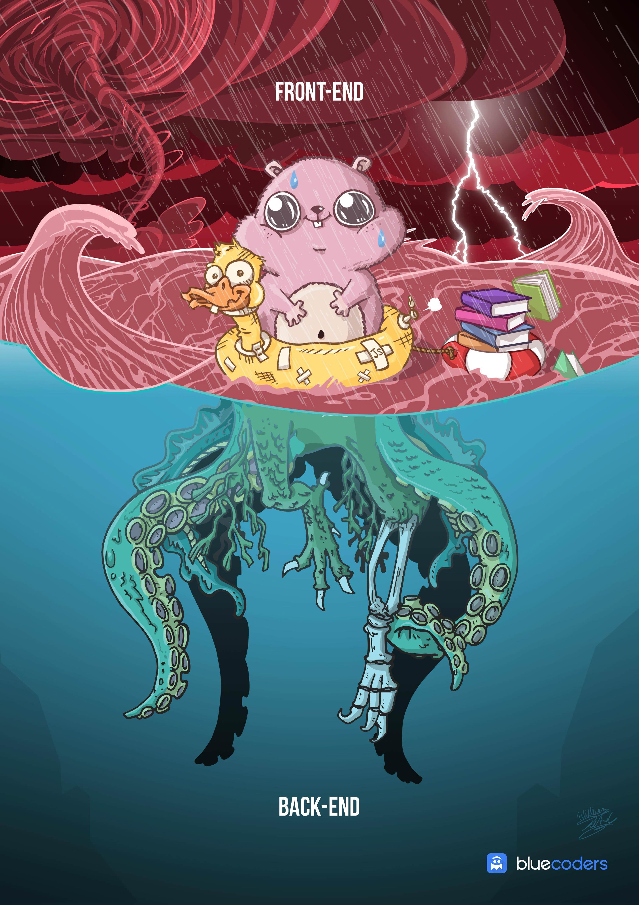
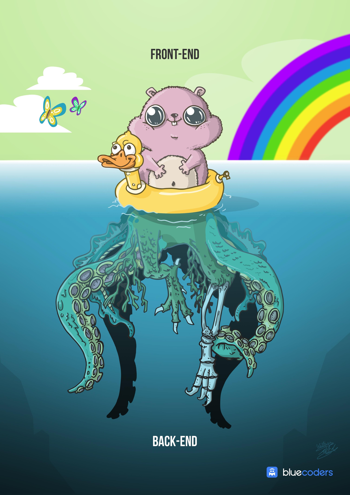
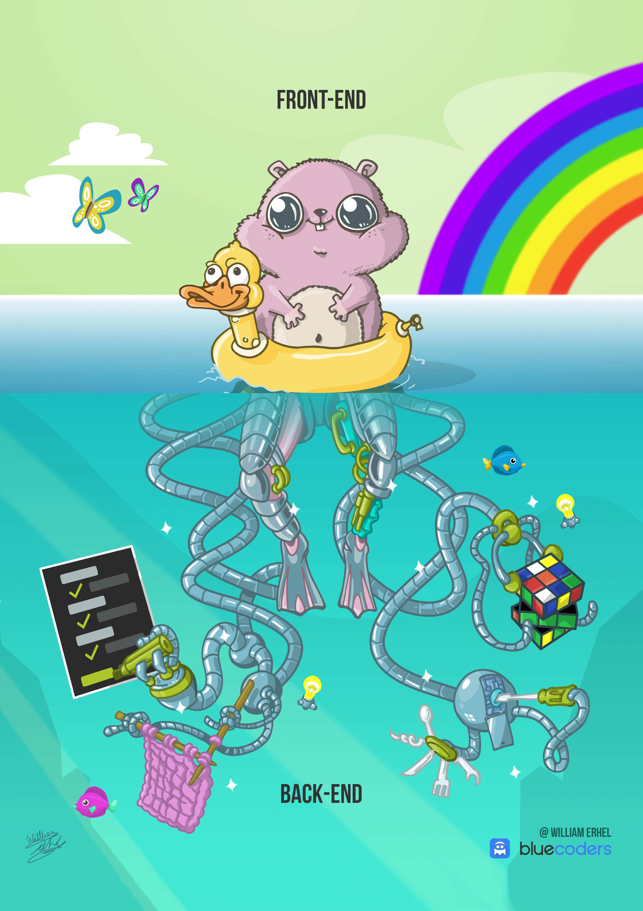

<!-- _class: invert -->
<!-- backgroundImage: null -->
<style>
  section.left h4, section.left p {
    text-align: left;
  }
</style>

# How the Web Works

---

### Frontend vs Backend

---


---


---


---
<!-- _class: invert -->
<!-- backgroundImage: null -->
# Data Types

---
<!-- _class: left -->

# String

* Quotes (use backticks `)
* Multi-line
* Built-in methods and props
  * [Documentation](https://developer.mozilla.org/en-US/docs/Web/JavaScript/Reference/Global_Objects/String)
* Concatenation

----

## String: Quotes

```js
const string1 = "This is a string";
const string2 = 'This also works!';
const string3 = `My favorite`;
```

---

## String: Multiline

```js
const string1 = "This is a string\
  Continue the string here";

const string2 = "This also works!\nthis is a new line";

const string3 = `My favorite
  way of doing strings`;
```

---

## String: Built-in methods and props

* [Documentation](https://developer.mozilla.org/en-US/docs/Web/JavaScript/Reference/Global_Objects/String)

---
Example

```js
const alphabet = `ABCDEFGHIJKLMNOPQRSTUVWXYZ`;

const alphabet_length = alphabet.length;

const lowercase_alphabet = alphabet.toLowerCase();
```

___

## String: Concatenation

using anything but backticks 😥

```js
var name = "Wes Reed"

var welcomeMsg = "Welcome, " + name + " to this game !"
```

___

## String: Concatenation

using backticks 😌

```js
var name = `Wes Reed`

var welcomeMsg = `Welcome, ${ name } to this game !`;
```

---

# Numbers

```js
var number1 = 2;

var number2 = 3;

var number3 = number1 + number2; // 5

var number3 = number1 - number2; // -1

var number3 = number1 * number2; // 6

var number3 = number1 / number2; // 0.6666

var number3 = number1 ** number2; // 8

var number3 = Math.pow(number1, number2); // 8
```

---

## Numbers: Casting

```js
parseFloat(3.14);
parseFloat('3.14');
parseFloat('314e-2');
parseFloat('0.0314E+2');
parseFloat('3.14more non-digit characters');
```

---

# Objects

* Array
* Functions
* JSON objects

---

## Objects: functions

```js
function sayHello (name= "World") {
    console.log(`Hello, ${ name }!`)
}

 // Same as

var sayHello = function (name = "World") {
    console.log(`Hello, ${ name }!`)
}

// Kinda similar to that

var sayHello = (name = "World") => {
    console.log(`Hello, ${ name }!`)
}

var sayHello = (name= "World") => `Hello, ${ name }!`
```
