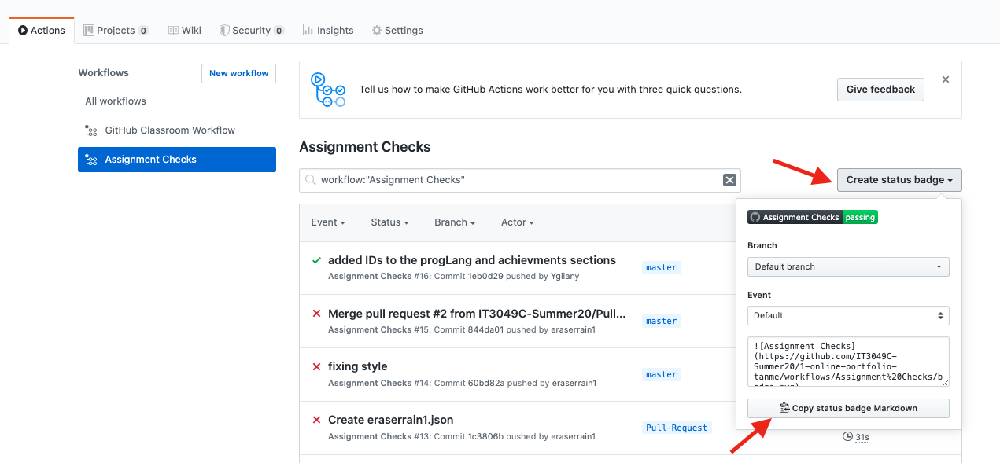

In some of the assignments, you may be asked to update the badge link on the repository README file.

* Click on the **Actions** Tab at the top of your repository.
  * 
* Navigate to the **Assignment Checks** action job.
  * 
* Copy the badge.
  * 

P.S.: In most assignments, I created a small script that automatically updates the link for you when you install the repository's dependencies using `npm install`
