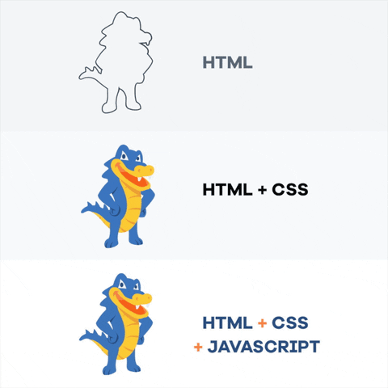

## Learning outcomes
1. Brush up on creating simple web pages using *HTML* and present content using different `html` elements.
2. Brush up on styling web pages using *CSS* to make the page look aesthetically pleasing.
3. Practice using of **Git and GitHub** in a development cycle.
4. Learn to deploy and host your webpage using **GitHub Pages**
## Background
### HTML and CSS
HTML and CSS are two of the core technologies for building Web pages. HTML is the language through which we describe the structure of the page, and CSS is the language through which we describe the visual and aural layout of the page, and the overall presentation of the page for different devices and screen sizes.

Once we learn about JavaScript, you'll see how it adds interactivity to your page

### Git and GitHub
Git is software for tracking changes in any set of files. It's most commonly used for coordinating and sharing source code among developers during software development. GitHub is a cloud-based hosting service for git repositories.

## Guidelines
* This assignment utilized automated-tests to check for the correctness of your code. These tests can be a bit specific about what you name things, where do you place them, what `HTML` tag you use for them, ...etc. Please Follow the instructions on this assignment for the best outcome.
* This is a lab-style assignment with step-by-step
* Learn to make frequent git commits. 
    * The instructions will suggest a few checkpoints where you can commit the code. This will be marked by the following icon: 
        * This won't be in all assignments.
    * 💬 As a rule of thumb, you should commit your code at the end of every complete thought.
    * 🚩 Planning your code will help you identify checkpoints  where you can commit your code.
    * Use meaningful commit messages.
* To be able to run the automated grading checks, make sure you have installed Node.js, per the instructions posted on Canvas.

## Instructions

This is a **2-parts** lab; In the [first one](part1), you'll brush up on Creating a Web Page, and learn to use git to manage your code. You will also end this part by learning to deploy and host your webpage using GitHub Pages ~(17 pt)~. In [Part 2](part2.md), you will demonstrate your ability to work on GitHub repository as a collaborator, you will learn to fork a repository, create a branch and submit a pull request to merge your code.
    
Accept the GitHub Classroom assignment on Canvas to create a repository for you with some starter files. Note unlike the previous lab, a GitHub Repository will be create for you.

Don't forget to check the [finalize page](finalize) for instructions on submitting your assignment, 

<iframe width="560" height="315" src="https://www.youtube-nocookie.com/embed/O7UqfRtQqds" title="YouTube video player" frameborder="0" allow="accelerometer; autoplay; clipboard-write; encrypted-media; gyroscope; picture-in-picture" allowfullscreen></iframe>